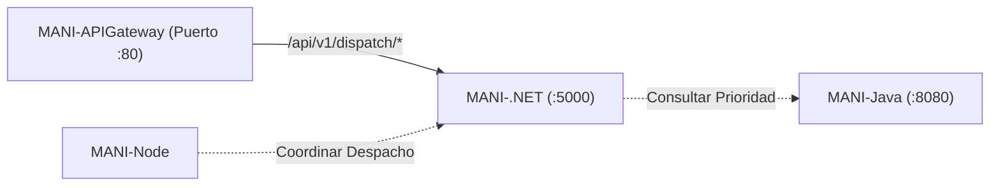

# MANI-.NET — Servicio de Despacho y Emparejamiento de MANI

Microservicio del ecosistema **MANI** (*TRAMA · Ingeniería de Software*), desarrollado en **C# y .NET 8 (ASP.NET Core Web API)**, responsable del algoritmo de emparejamiento geográfico y la exclusión concurrente de asignación.

Este repositorio gestiona el ciclo operativo de despacho: cálculo de cercanía entre manicuristas y clientes, evaluación de candidatos y resolución atómica de colisiones de aceptación (*Race Conditions*).

---

## 🏛️ Rol en la Arquitectura SOA (ADR-0019)

Dentro de la arquitectura de servicios de MANI, **`MANI-.NET`** opera como el motor de alta concurrencia y despacho:

* **Puerto Interno:** `5000`
* **Exposición Externa:** Vía **`MANI-APIGateway`** bajo el prefijo `/api/v1/dispatch/*`.
* **Capacidades de Negocio (SRS V3 / RNF-05):**
  - **RF-12:** Emparejamiento de manicuristas según cercanía geográfica y disponibilidad.
  - **RF-14:** Ciclo de aceptación y rechazo de órdenes de servicio por parte de profesionales.
  - **RNF-03:** Idempotencia en comandos de despacho.
  - **RNF-05:** **Exclusión Concurrente Atómica:** Si múltiples manicuristas intentan aceptar una misma orden simultáneamente, la primera confirmada gana (`200 OK`) y las solicitudes colisionantes reciben inmediatamente un código HTTP **`409 Conflict`**.



---

## 🚀 Endpoints Principales

| Método | Ruta en Gateway | Descripción | Código Éxito | Código Conflicto |
| :--- | :--- | :--- | :---: | :---: |
| `GET` | `/api/v1/dispatch/health` | Healthcheck y estado del servicio de despacho. | `200 OK` | N/A |
| `POST` | `/api/v1/dispatch/match` | Algoritmo de búsqueda de profesionales por cercanía. | `200 OK` | `400` |
| `POST` | `/api/v1/dispatch/requests/{id}/accept` | Aceptación atómica de servicio con exclusión mutua. | `200 OK` | **`409 Conflict`** |

### Ejemplo: Aceptación con Exclusión Concurrente
**Petición (`POST /api/v1/dispatch/requests/req-101/accept`):**
```json
{
  "allyId": "aliado-carolina"
}
```

* **Respuesta del primer aliado que acepta (`200 OK`):**
```json
{
  "message": "Solicitud asignada exitosamente al profesional.",
  "requestId": "req-101",
  "assignedAllyId": "aliado-carolina",
  "status": "ASSIGNED",
  "correlationId": "c9a4b2a8-1234-5678-90ab-cdef12345678",
  "timestamp": "2026-10-05T19:50:00Z"
}
```

* **Respuesta a cualquier intento posterior (`409 Conflict`):**
```json
{
  "error": "La solicitud ya fue aceptada por otro profesional.",
  "status": 409,
  "assignedTo": "aliado-carolina",
  "correlationId": "c9a4b2a8-1234-5678-90ab-cdef12345678",
  "timestamp": "2026-10-05T19:50:01Z"
}
```

---

## 🛠️ Stack Tecnológico

* **Framework:** .NET 8 (ASP.NET Core Web API).
* **Lenguaje:** C# 12.
* **Servidor Kestrel:** Configurado para escuchar en puerto `5000`.
* **Contenerización:** Docker multi-stage (`dotnet/sdk:8.0` + `dotnet/aspnet:8.0`).

---

## ⚙️ Configuración (`appsettings.json`)

```json
{
  "Logging": {
    "LogLevel": {
      "Default": "Information",
      "Microsoft.AspNetCore": "Warning"
    }
  },
  "AllowedHosts": "*",
  "ServiceUrls": {
    "CoreService": "http://core-service:3000",
    "RulesService": "http://rules-service:8080",
    "Gateway": "http://localhost:80"
  }
}
```

---

## 💻 Ejecución Local

### Opción 1: Con .NET CLI
```bash
# Restaurar dependencias
dotnet restore

# Ejecutar aplicación en puerto 5000
dotnet run
```

### Opción 2: Con Docker
```bash
# Construir imagen Docker
docker build -t mani-dispatch-dotnet:local .

# Ejecutar contenedor
docker run -d -p 5000:5000 --name mani-dispatch mani-dispatch-dotnet:local
```

---

## 👥 Equipo y Gobernanza
* **Organización:** [TRAMA · Ingeniería de Software](https://github.com/Trama-AS)
* **Repositorio Oficial:** [MANI-.NET](https://github.com/Trama-AS/MANI-.NET)
